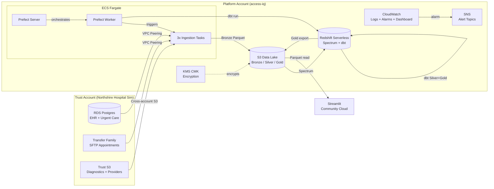

<!-- Replace with actual dashboard screenshot -->


**[Live Dashboard](https://access-iq.streamlit.app)** | [Case Study](docs/case-study.md) | [Architecture Decisions](docs/adr/)

# Access-IQ Platform

End-to-end NHS Trust analytics platform — simulating a consultancy engagement that ingests operational healthcare data, models it through a medallion architecture, and surfaces access and inequality analytics.

## The Problem

NHS Trusts generate vast amounts of operational data across EHR systems, A&E departments, diagnostic services, and appointment bookings — but rarely have the engineering infrastructure to turn it into actionable inequality analytics.

Waiting times, A&E breaches, and diagnostic delays affect deprived communities disproportionately. National targets (18-week RTT, 6-week DM01, 4-hour A&E) are tracked in aggregate, but breakdowns by IMD decile, ethnicity, age band, and gender are largely invisible.

**Access-IQ** demonstrates how a data engineering consultancy would build the analytics infrastructure for a fictional NHS Trust ("Northshire Trust") to surface these patterns. The platform ingests synthetic but structurally realistic healthcare data from three source systems, models it through a Bronze/Silver/Gold medallion architecture, and delivers inequality-aware dashboards to Trust analysts.

Two AWS accounts model a real vendor-client boundary — the Trust controls its own data, the platform account processes it under contract. All infrastructure is CDK-managed with an ephemeral deploy/destroy pattern to avoid idle costs.

## How It Works


The platform spans two AWS accounts connected via VPC peering. The **Trust account** hosts the simulated hospital environment (RDS Postgres, SFTP via Transfer Family, S3 exports). The **Platform account** runs the analytics infrastructure: ECS Fargate for ingestion, S3 data lake with KMS encryption, Redshift Serverless for warehousing and dbt modelling, Prefect for orchestration, and CloudWatch for observability.

Gold-layer Parquet files are exported to S3 and read by a Streamlit dashboard on Community Cloud via DuckDB — keeping the dashboard stateless and free-tier. See [Data Flow Diagram](docs/images/architecture-dataflow.png) for the Bronze to Silver to Gold pipeline.

<details><summary>View as Mermaid (interactive)</summary>



</details>

## Tech Stack

| Component            | Tool                      | Version         | Why                                             |
| -------------------- | ------------------------- | --------------- | ----------------------------------------------- |
| **Ingestion**        | ECS Fargate + Python      | 3.12 + PyArrow  | Parallel Bronze ingestion from 3 sources        |
| **Storage**          | S3 + KMS CMK              | —               | Encrypted data lake with medallion layout       |
| **Warehouse**        | Redshift Serverless       | 8 RPU           | Spectrum on Bronze, native Silver/Gold, $0 idle |
| **Modelling**        | dbt-core + dbt-redshift   | 1.10            | Incremental Silver, dimensional Gold marts      |
| **Data Quality**     | dbt-expectations + GE 1.x | —               | DQ gates block Gold promotion on failure        |
| **Orchestration**    | Prefect 3 (self-hosted)   | ECS Fargate     | Ephemeral server, ECS work pool, $0 idle        |
| **Dashboard**        | Streamlit                 | Community Cloud | Static Gold Parquet via DuckDB, $0/mo           |
| **Infrastructure**   | AWS CDK                   | Python          | 9 stacks, ephemeral deploy/destroy              |
| **Pseudonymisation** | HMAC-SHA-256              | Lambda UDF      | NHS Mod-11 validated, per-env key               |

## Quick Start

**Prerequisites:** AWS CLI v2 with SSO configured, [uv](https://docs.astral.sh/uv/), Node.js (for CDK), Docker.

```bash
git clone https://github.com/chiplusplus/access-iq-platform.git && cd access-iq-platform
make setup        # Create venv, install deps, pre-commit hooks
make up           # Deploy infra, seed data, start pipeline (~25 min)
```

`make up` invokes `scripts/session.sh` which orchestrates an 8-step deployment:

1. **Trust bootstrap** — deploys Trust CDK stack, seeds RDS with ~100K synthetic patients + ~586K encounters via `northshire-hospital-sim`, publishes to RDS/S3/SFTP
2. **Platform deploy** — deploys all Platform stacks (lake, secrets, catalog, ECR, network, warehouse, compute, observability, budget) with VPC peering
3. **Redshift pre-warm** — creates Spectrum external schema, restores snapshot if available
4. **Secrets + Docker + dbt + Prefect** — seeds Secrets Manager, builds and pushes ingestion image, registers Spectrum tables, starts Prefect server and worker

After completion: Streamlit URL printed, CloudWatch dashboard URL printed, Prefect UI at `localhost:4200` (via SSM tunnel).

## Session Workflow

```bash
make up           # Deploy all stacks, restore Redshift, seed Trust, start Prefect
make ingest       # Trigger Bronze ingestion (3 ECS tasks in parallel)
make pipeline     # Run full pipeline: ingest -> dbt -> DQ -> Gold export
make status       # Show stack status, Redshift state, latest manifest
make down         # Snapshot Redshift, destroy all ephemeral stacks
```

`make down` returns to **$0 idle cost**. Stateful resources (S3 lake, KMS key, Secrets Manager, ECR, Glue Catalog) persist with `RETAIN` policy. Redshift is snapshotted before destruction and restored on next `make up`.

Additional targets: `make dbt CMD="run --select silver"`, `make rs-tunnel`, `make dq-gate`, `make dashboard`, `make reconnect`.

## Lake Layout

| Prefix        | Owner     | Description                                                                               |
| ------------- | --------- | ----------------------------------------------------------------------------------------- |
| `bronze/`     | Ingestion | Raw Parquet, partitioned `source/entity/ingest_date/run_id`                               |
| `silver/`     | dbt       | Conformed tables: patients, encounters, appointments, urgent_care, diagnostics, providers |
| `gold/`       | dbt       | Marts: fct_wait_times, fct_inequality, fct_urgent_care, fct_utilisation + 6 dimensions    |
| `_manifests/` | Ingestion | JSON manifest per run (idempotency + audit)                                               |
| `_dq/`        | GE        | Great Expectations validation results                                                     |

## Architecture Decisions

The project documents key technical decisions as Architecture Decision Records. Highlights:

- [ADR-009: Redshift Serverless](docs/adr/ADR-009-redshift-serverless.md) — $0 idle cost, Spectrum on Bronze avoids ETL duplication
- [ADR-010: Self-hosted Prefect](docs/adr/ADR-010-self-hosted-prefect.md) — Cloud push-pool incompatible with free tier
- [ADR-011: Static Gold Export](docs/adr/ADR-011-static-gold-export.md) — DuckDB reads Parquet on Streamlit Community Cloud
- [ADR-015: Two-account Boundary](docs/adr/ADR-015-two-account-staging.md) — models real NHS Trust engagement
- [All 13 ADRs](docs/adr/)

## Future Work

- **Demand forecasting** — Prophet/ARIMA on fct_wait_times time series to predict breach risk by specialty
- **Referral-letter triage** — text classification on referral free-text fields to prioritise urgent pathways
- **Breach-rate anomaly detection** — statistical process control on fct_urgent_care 4h/12h rates
- **Real-time streaming** — Kinesis Data Streams replacing batch ECS tasks for sub-minute ingestion latency

## Configuration

Environment variables (with defaults) for `scripts/session.sh`:

| Variable        | Default                      | Description                       |
| --------------- | ---------------------------- | --------------------------------- |
| `AWS_PROFILE`   | `CHI-Engineer-222308823356`  | Platform account SSO profile      |
| `TRUST_PROFILE` | `northshire-trust`           | Trust account SSO profile         |
| `CDK_ENV`       | `dev`                        | Target environment (`dev`/`prod`) |
| `REGION`        | `eu-west-2`                  | AWS region                        |
| `TRUST_REPO`    | `../northshire-hospital-sim` | Path to Trust simulator repo      |

See [.env.example](.env.example) for the full runtime configuration schema.

---

**License:** MIT | **Author:** [Chia A](https://github.com/chiplusplus) | [Case Study](docs/case-study.md)
