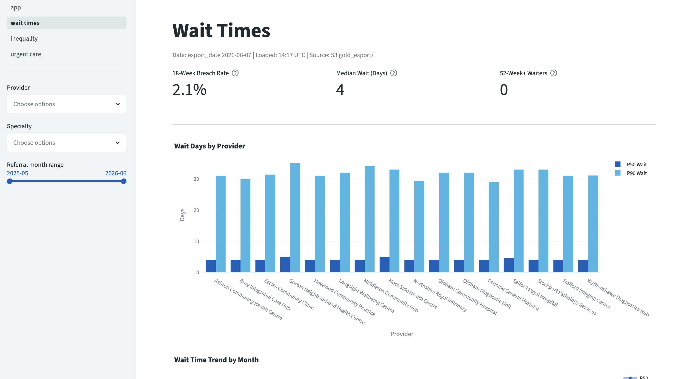
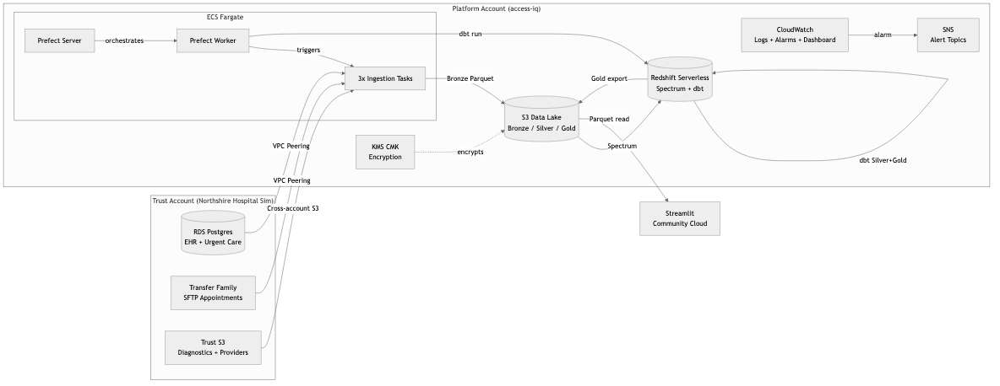
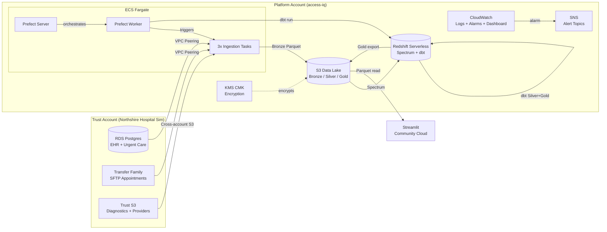

<!-- Replace with actual dashboard screenshot -->



### **[View the Live Dashboard →](https://access-iq-platform-v1.streamlit.app/)**

[Case Study](docs/case-study.md) | [Architecture Decisions](docs/adr/)

# Access-IQ Platform

End-to-end NHS Trust analytics platform simulating a consultancy engagement that ingests operational healthcare data, models it through a medallion architecture, and surfaces access and inequality analytics.

## The Problem

NHS Trusts generate vast amounts of operational data across EHR systems, A&E departments, diagnostic services, appointment bookings etc, but they rarely have the engineering infrastructure to turn it into actionable inequality analytics.

Waiting times, A&E breaches, and diagnostic delays affect deprived communities disproportionately. National targets (18-week RTT, 6-week DM01, 4-hour A&E) are tracked in aggregate, but breakdowns by IMD decile, ethnicity, age band, and gender are largely invisible.

**Access-IQ** demonstrates how a data engineering consultancy would build the analytics infrastructure for a fictional NHS Trust ("Northshire Trust") to surface these patterns. The platform ingests synthetic but structurally realistic healthcare data from three source systems, models it through a Bronze/Silver/Gold medallion architecture, and delivers inequality-aware dashboards to Trust analysts.

Two AWS accounts model a real vendor-client boundary - the Trust controls its own data, the platform account processes it under contract. All infrastructure is CDK-managed with an ephemeral deploy/destroy pattern to avoid idle costs.

## How It Works



The platform spans two AWS accounts connected via VPC peering. The **Trust account** hosts the simulated hospital environment (RDS Postgres, SFTP via Transfer Family, S3 exports). The **Platform account** runs the analytics infrastructure: ECS Fargate for ingestion, S3 data lake with KMS encryption, Redshift Serverless for warehousing and dbt modelling, Prefect for orchestration, and CloudWatch for observability.

Gold-layer Parquet files are exported to S3 and read by a Streamlit dashboard on Community Cloud via DuckDB - keeping the dashboard stateless and free-tier. See [Data Flow Diagram](docs/images/architecture-dataflow.png) for the Bronze to Silver to Gold pipeline.

<details><summary>View as Mermaid (interactive)</summary>



</details>

## Tech Stack

| Component            | Tool                      | Version         | Why                                                                                                                                                                  |
| -------------------- | ------------------------- | --------------- | -------------------------------------------------------------------------------------------------------------------------------------------------------------------- |
| **Ingestion**        | ECS Fargate + Python      | 3.12 + PyArrow  | Serverless containers avoid idle EC2 costs; Fargate scales each source independently without cluster management                                                      |
| **Storage**          | S3 + KMS CMK              | -               | Decouples storage from compute; KMS CMK enables per-env key rotation and cross-account grants that SSE-S3 cannot                                                     |
| **Warehouse**        | Redshift Serverless       | 8 RPU           | Spectrum queries Bronze in-place (no ETL duplication), RPU auto-scales to zero when idle, and native dbt adapter avoids Athena per-query costs                       |
| **Modelling**        | dbt-core + dbt-redshift   | 1.10            | Declarative SQL transformations with built-in lineage, test contracts, and incremental materialisation that Redshift stored procedures lack                          |
| **Data Quality**     | dbt-expectations + GE 1.x | -               | dbt-expectations validates inline during transforms; Great Expectations covers row-level profiling that dbt tests alone cannot express                               |
| **Orchestration**    | Prefect 3 (self-hosted)   | ECS Fargate     | Free self-hosted server on Fargate avoids Prefect Cloud costs; ECS work pool launches tasks as ephemeral containers with $0 idle                                     |
| **Dashboard**        | Streamlit                 | Community Cloud | Reads static Gold Parquet via DuckDB with no warehouse connection; Community Cloud hosts free-tier with zero infrastructure                                          |
| **Infrastructure**   | AWS CDK                   | Python          | Imperative Python over declarative YAML keeps config DRY with shared `EnvConfig`; L2 constructs handle IAM/encryption defaults that CloudFormation requires manually |
| **Pseudonymisation** | HMAC-SHA-256              | Lambda UDF      | Deterministic hash preserves join integrity across tables while NHS Mod-11 validation catches malformed identifiers before pseudonymisation                          |

## Quick Start

**Prerequisites:** AWS CLI v2 with two named profiles configured (one for the Platform account, one for the Trust account), [uv](https://docs.astral.sh/uv/), Node.js (for CDK), Docker.

```bash
# Clone both repos as siblings
git clone https://github.com/chiplusplus/access-iq-platform.git
git clone https://github.com/chiplusplus/northshire-hospital-sim.git

# Set up the Trust simulator (create virtual environment and install dependencies)
cd northshire-hospital-sim
python -m venv .northshire-hospital-sim
.northshire-hospital-sim/bin/pip install -r requirements.txt

# Configure Trust CDK context (required for cross-account VPC peering)
cp infra/cdk.context.example.json infra/cdk.context.json
# Edit infra/cdk.context.json — set platformAccountId to your Platform AWS account ID
# See northshire-hospital-sim README for full variable reference

# Set up the platform
cd ../access-iq-platform
cp .env.example .env       # Fill in AWS profile, bucket name, secret ARNs
# Review infra/config/dev.json for account IDs, VPC CIDRs, Redshift capacity
make setup                 # Create venv, install deps, pre-commit hooks

# Log in to both AWS accounts (skip if using IAM keys)
export PLATFORM_PROFILE=<your-platform-profile>
export TRUST_PROFILE=<your-trust-profile>
aws sso login --profile $PLATFORM_PROFILE
aws sso login --profile $TRUST_PROFILE

# Deploy everything
make up                    # Deploy infra, seed data, start pipeline (~65 min)
```

`make up` invokes `scripts/session.sh` which orchestrates an 8-step deployment:

1. **Trust bootstrap** - deploys Trust CDK stack, seeds RDS with ~100K synthetic patients + ~586K encounters via `northshire-hospital-sim`, publishes to RDS/S3/SFTP
2. **Platform deploy** - deploys all Platform stacks (lake, secrets, catalog, ECR, network, warehouse, compute, observability, budget) with VPC peering
3. **Redshift pre-warm** - creates Spectrum external schema, waits for workgroup availability
4. **Secrets + Docker + dbt + Prefect** - seeds Secrets Manager, builds and pushes ingestion image, registers Spectrum tables, starts Prefect server and worker

After completion: Streamlit URL printed, CloudWatch dashboard URL printed, Prefect UI at `localhost:4200` (via SSM tunnel).

## Environments

Only dev is actively deployed. The CDK stacks and config files support a separate prod environment (`infra/config/prod.json` with RETAIN policies, Redshift snapshots, 90-day log retention), but running a second account with stateful resources is not justified for a portfolio project. See [Environment Matrix](docs/architecture/environment_matrix.md) for the full prod design.

Each environment is driven by a config file at `infra/config/{dev,prod}.json` where you set your own account IDs, region, VPC CIDRs, and Redshift capacity. CDK reads the config matching the `CDK_ENV` variable:

```bash
CDK_ENV=dev make infra-bootstrap   # one-time CDK bootstrap per account
CDK_ENV=dev make up                # deploy dev (default)
```

In dev, all resources use `DESTROY` removal policy — `make down` leaves the accounts at $0 idle cost with nothing persisted between sessions.

## Session Workflow

```bash
make up           # Deploy all stacks, seed Trust data, start Prefect
make status       # Show stack status, Redshift state, latest manifest
make pipeline     # Optional (pipeline is scheduled to trigger on the hour every hour): Run full pipeline: ingest -> dbt -> DQ -> Gold export
make dashboard    # Run Streamlit dashboard locally (reads Gold Parquet from S3 via DuckDB)
make down         # Destroy all stacks across both accounts
```

`make down` returns to **$0 idle cost**. In dev, every resource is destroyed (DESTROY removal policy) except the KMS CMK, which uses RETAIN in both environments because its pending-deletion window would break redeploy cycles.

**Budget safety net**: The BudgetStack deploys an AWS Budget with a monthly ceiling ($10 dev / $20 prod). If actual spend reaches 80% of the ceiling, an SNS alarm triggers a Lambda that **automatically destroys** the ephemeral stacks (compute, warehouse, network, observability, iam). Stateful stacks (lake, secrets, catalog, ECR) are not touched. This is a last-resort guard against forgotten `make down` sessions — if it fires, redeploy with `make up` when ready.

Additional targets: `make dbt CMD="run --select silver"`, `make rs-tunnel`, `make dq-gate`, `make reconnect`, `make profile`, `make ready`.

## Lake Layout

| Prefix        | Written by | Description                                                                                                                                        |
| ------------- | ---------- | -------------------------------------------------------------------------------------------------------------------------------------------------- |
| `bronze/`     | Ingestion  | Raw Parquet, partitioned `source/entity/ingest_date/run_id`. Registered as Spectrum external tables via `dbt-external-tables` for Redshift queries |
| `silver/`     | dbt        | Conformed tables: patients, encounters, appointments, urgent_care, diagnostics, providers                                                          |
| `gold/`       | dbt        | Marts: fct_wait_times, fct_inequality, fct_urgent_care, fct_utilisation + 6 dimensions                                                             |
| `_manifests/` | Ingestion  | JSON manifest per run (idempotency + audit)                                                                                                        |
| `_dq/`        | GE         | Great Expectations validation results                                                                                                              |

## Observability

The ObservabilityStack deploys production-grade monitoring across the full pipeline:

**Dashboards**: A Pipeline Health dashboard (`access-iq-{env}-pipeline-health`) shows last-success timestamps, GE gate metrics, ingestion status, and ECS resource utilisation.

**Metric Filters**: 15+ CloudWatch metric filters on the pipeline log group track structured events across the lifecycle: ingestion start/complete/fail, dbt Silver/Gold completion, GE gate pass/fail, Gold export completion, and validation errors.

**Alarms**:

| Alarm                 | What it catches                                        |
| --------------------- | ------------------------------------------------------ |
| Ingestion failure     | Manifest `status: failed` in logs                      |
| GE gate failure       | Data quality validation failed on Silver tables        |
| Validation error      | GE infrastructure error during checkpoint execution    |
| Pipeline staleness    | No successful pipeline run in 48h (configurable)       |
| Gold export staleness | No Gold export in 50h (configurable)                   |
| Budget threshold      | 80% of monthly ceiling reached; triggers auto-teardown |
| ECS OOM detection     | EventBridge rule catches container crashes/OOM kills   |

Staleness alarms use `BREACHING` on missing data, so they fire even when the pipeline simply hasn't run (e.g. forgotten `make down`). Evaluation windows are configurable in `infra/config/{env}.json`.

**Permanent Dashboard Exports**: Gold Parquet files are exported to a KMS-encrypted S3 bucket (`access-iq-dashboard-exports`) that lives outside the ephemeral stacks. This bucket, its KMS key, and a read-only IAM user persist across `make down` / budget teardowns, keeping the Streamlit Community Cloud dashboard live between sessions. See the [Runbook](docs/governance/runbook.md#permanent-dashboard-infrastructure-one-time-setup) for one-time setup instructions.

## Architecture Decisions

The project documents key technical decisions as Architecture Decision Records. Highlights:

- [ADR-001: Medallion Architecture](docs/adr/ADR-001-medallion-architecture.md) - Bronze/Silver/Gold with Spectrum on Bronze
- [ADR-004: Ephemeral Infrastructure](docs/adr/ADR-004-ephemeral-infrastructure.md) - deploy/destroy pattern, ~94% cost reduction
- [ADR-008: Static Gold Export](docs/adr/ADR-008-static-gold-export.md) - DuckDB reads Parquet on Streamlit Community Cloud
- [ADR-009: Self-hosted Prefect](docs/adr/ADR-009-self-hosted-prefect.md) - Cloud push-pool incompatible with free tier
- [All 9 ADRs](docs/adr/)

## Future Work

The Gold layer and pipeline infrastructure create natural extension points. These next areas to be explored for this project are:

- **Demand forecasting** - the fct_wait_times time series lends itself to Prophet/ARIMA modelling to predict breach risk by specialty, giving Trust managers lead time to reallocate capacity
- **Referral-letter triage** - referral free-text fields could be classified to prioritise urgent pathways, reducing manual clinical triage overhead
- **Breach-rate anomaly detection** - statistical process control on fct_urgent_care 4h/12h breach rates could surface emerging pressure points before they hit aggregate targets
- **Real-time ingestion** - replacing batch ECS tasks with Kinesis Data Streams would enable sub-minute latency for time-sensitive sources like A&E arrivals

---

**License:** MIT | **Author:** [Chia A](https://github.com/chiplusplus) | [Case Study](docs/case-study.md)
